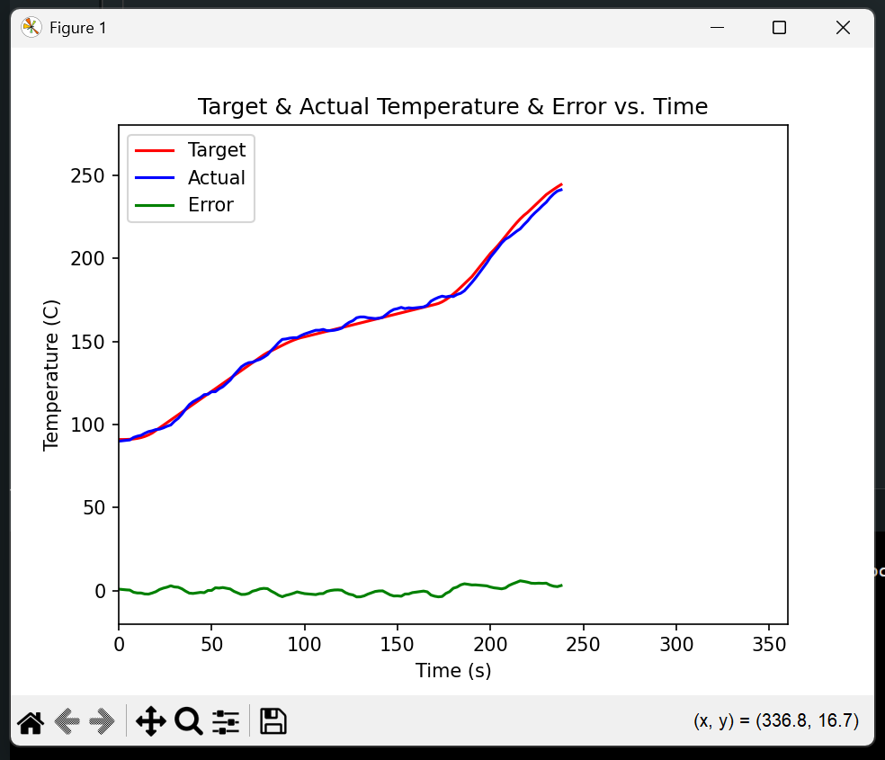

<h1>Custom Reflow Hot Plate</h1>

<h3>Why did I make this?</h3>
<p>Designing and purchasing custom PCBs is expensive. For reference, my first custom devboard was quoted by JLCPCB at around $180, and more than half of that was due to assembly costs. Therefore, I sought to cut costs by designing my own at-home PCB assembly system, beginning with the "simplest" part of the process, which is being able to solder on components, both surface-mount and through-hole. This hot plate will be used to solder surface-mount components which would otherwise be extremely hard to solder by hand otherwise due to high pin density and small pin sizing.</p>

<h3>Why not just buy one?</h3>
<p>The cheapest reflow hot plate available online is around $40; additionally, this is from a site which has a questionable reputation. Since I was able to salvage some electronics components from old projects/appliances at home for the central controller, I decided to simply build my own to further reduce costs, only spending an extra $26 on a 240VAC relay, a cheap 600W heater element, and a thermocouple for precise temperature control.</p>

<h3>How does it work?</h3>
<p>Reflow soldering is a well-documented technique. Using a precise heating curve for four distinct stages, the process proceeds as follows: preheat, thermal soak, reflow, cooling. The thermocouple and the central controlling logic is necessary to maintain the correct temperature so that the solder paste on the board melts at the precise moment where it can then form a solid electrical connection between the pins of the component and the exposed copper on the board. 
<ol>
  <li>
    Preheat
  </li>
  <ul>
    <li>
      Heating rates need to be controlled during the preheat phase to prevent bubbling/splatter of the solder paste and warping of the components.
    </li>
  </ul>
  <li>
    Thermal soak
  </li>
  <ul>
    <li>
      The thermal soak phase temperature needs to be held steady to ensure even heating.    
    </li>
  </ul>
  <li>
    Reflow
  </li>
  <ul>
    <li>
      The peak temperature, achieved during reflow, needs to be tuned so that the sensitive components are not damaged while the solder paste is free to flow; due to the forces of surface tension, the paste will "pull" the pins directly over the copper on the board and ensure a strong connection.
    </li>
  </ul>
  <li>
    Cooling
  </li>
  <ul>
    <li>
      Cooling needs to be gradual so that the joints are solid and no thermal shock effects occur.
    </li>
  </ul>
</ol>

<h3>Technical details</h3>



<p>The controller uses a PD algorithm (Kp=0.05, Kd=Kp*Td=0.35) to maintain a mean absolute error of +-1.8 degrees Celsius.</p>
<p>The curve shown in this diagram follows a profile given by the datasheet for the ChipQuik NC191SNL15 lead-free solder paste</p>

<h3>Sample testing output</h3>
<p>The example output below is directly printed out by serial and read in by data_visualization.py (located in firmware folder). The first few lines are parameters for heating curve smoothing which are calculated automatically by the software; the following lines all include time, target temperature, actual temperature, and deviation. Some lines in the middle say "Bezier," these are for debugging the smoothing parameters. Nominal heating rate is automatically calculated based on the smoothing parameters. </p>

```
0, 91.00, 91.01, 91.04, 91.14, 91.33, 91.65, 92.13, 92.79, 93.67, 94.81, 
1, 143.28, 144.32, 145.42, 146.55, 147.67, 148.77, 149.80, 150.75, 151.58, 152.27,
2, 172.22, 172.84, 173.83, 175.14, 176.71, 178.51, 180.47, 182.55, 184.70, 186.87,
3, 203.00, 205.25, 207.74, 210.41, 213.17, 215.96, 218.70, 221.31, 223.73, 225.87,
4, 238.33, 239.93, 241.49, 242.99, 244.39, 245.67, 246.78, 247.70, 248.40, 248.85, Time:10969,Target:91.17,Actual:89.50,Error:1.67
Time:12969,Target:91.00,Actual:90.00,Error:1.00
Time:14969,Target:91.01,Actual:90.25,Error:0.76
Time:16969,Target:91.05,Actual:90.50,Error:0.55
Time:18969,Target:91.15,Actual:90.75,Error:0.40
Time:20969,Target:91.35,Actual:92.25,Error:-0.90
Time:22969,Target:91.68,Actual:93.00,Error:-1.32
Time:24969,Target:92.16,Actual:93.50,Error:-1.34
Time:26969,Target:92.84,Actual:94.75,Error:-1.91
Time:28969,Target:93.74,Actual:95.75,Error:-2.01
Time:30969,Target:94.89,Actual:96.25,Error:-1.36
Time:32969,Target:96.46,Actual:97.00,Error:-0.54
Time:34969,Target:98.03,Actual:97.25,Error:0.78
Time:36969,Target:99.59,Actual:98.00,Error:1.59
Time:38969,Target:101.16,Actual:99.00,Error:2.16
Time:40969,Target:102.73,Actual:99.75,Error:2.98
Time:42969,Target:104.30,Actual:102.00,Error:2.30
Time:44969,Target:105.87,Actual:103.75,Error:2.12
Time:46969,Target:107.44,Actual:106.25,Error:1.19
Time:48969,Target:109.00,Actual:109.25,Error:-0.25
Time:50969,Target:110.57,Actual:112.00,Error:-1.43
Time:52969,Target:112.14,Actual:113.75,Error:-1.61
Time:54969,Target:113.71,Actual:115.00,Error:-1.29
Time:56969,Target:115.28,Actual:116.25,Error:-0.97
Time:58969,Target:116.85,Actual:118.00,Error:-1.15
Time:60969,Target:118.42,Actual:118.25,Error:0.17
Time:62969,Target:119.98,Actual:119.75,Error:0.23
Time:64969,Target:121.55,Actual:119.75,Error:1.80
Time:66969,Target:123.12,Actual:121.50,Error:1.62
Time:68969,Target:124.69,Actual:122.75,Error:1.94
Time:70969,Target:126.26,Actual:124.75,Error:1.51
Time:72969,Target:127.83,Actual:126.75,Error:1.08
Time:74969,Target:129.40,Actual:129.75,Error:-0.35
Time:76969,Target:130.96,Actual:132.25,Error:-1.29
Time:78969,Target:132.53,Actual:134.75,Error:-2.22
Time:80969,Target:134.10,Actual:136.25,Error:-2.15
Time:82969,Target:135.67,Actual:137.25,Error:-1.58
Time:84969,Target:137.24,Actual:137.50,Error:-0.26
Time:86969,Target:138.81,Actual:138.50,Error:0.31
Time:88969,Target:140.38,Actual:139.25,Error:1.13
Time:90969,Target:141.94,Actual:140.50,Error:1.44
Bezier smoothing post 0.00
Time:92969,Target:143.28,Actual:142.00,Error:1.28
Bezier smoothing post 0.10
Time:94969,Target:144.32,Actual:144.50,Error:-0.18
Bezier smoothing post 0.20
Time:96969,Target:145.42,Actual:146.75,Error:-1.33
Bezier smoothing post 0.30
Time:98969,Target:146.55,Actual:149.25,Error:-2.70
Bezier smoothing post 0.40
Time:100969,Target:147.67,Actual:151.25,Error:-3.58
Nominal rate 0.28
Bezier smoothing pre 0.50
Time:102969,Target:148.77,Actual:151.50,Error:-2.73
Bezier smoothing pre 0.60
Time:104969,Target:149.80,Actual:152.00,Error:-2.20
Bezier smoothing pre 0.70
Time:106969,Target:150.75,Actual:152.25,Error:-1.50
Bezier smoothing pre 0.80
Time:108969,Target:151.58,Actual:152.25,Error:-0.67
Bezier smoothing pre 0.90
Time:110969,Target:152.27,Actual:153.50,Error:-1.23
Bezier smoothing pre 1.00
Time:112969,Target:152.78,Actual:154.50,Error:-1.72
Time:114969,Target:153.33,Actual:155.25,Error:-1.92
Time:116969,Target:153.89,Actual:156.00,Error:-2.11
Time:118969,Target:154.44,Actual:156.75,Error:-2.31
Time:120969,Target:155.00,Actual:156.75,Error:-1.75
Time:122969,Target:155.56,Actual:157.25,Error:-1.69
Time:124969,Target:156.11,Actual:156.50,Error:-0.39
Time:126969,Target:156.67,Actual:156.50,Error:0.17
Time:128969,Target:157.22,Actual:156.75,Error:0.47
Time:130969,Target:157.78,Actual:157.25,Error:0.53
Time:132969,Target:158.33,Actual:158.00,Error:0.33
Time:134969,Target:158.89,Actual:160.00,Error:-1.11
Time:136969,Target:159.44,Actual:161.50,Error:-2.06
Time:138969,Target:160.00,Actual:162.50,Error:-2.50
Time:140969,Target:160.56,Actual:164.25,Error:-3.69
Time:142969,Target:161.11,Actual:164.75,Error:-3.64
Time:144969,Target:161.67,Actual:164.75,Error:-3.08
Time:146969,Target:162.22,Actual:164.25,Error:-2.03
Time:148969,Target:162.78,Actual:164.00,Error:-1.22
Time:150969,Target:163.33,Actual:163.75,Error:-0.42
Time:152969,Target:163.89,Actual:164.00,Error:-0.11
Time:154969,Target:164.44,Actual:164.50,Error:-0.06
Time:156969,Target:165.00,Actual:166.25,Error:-1.25
Time:158969,Target:165.56,Actual:168.00,Error:-2.44
Time:160969,Target:166.11,Actual:169.25,Error:-3.14
Time:162969,Target:166.67,Actual:169.75,Error:-3.08
Time:164969,Target:167.22,Actual:170.50,Error:-3.28
Time:166969,Target:167.78,Actual:169.75,Error:-1.97
Time:168969,Target:168.33,Actual:170.25,Error:-1.92
Time:170969,Target:168.89,Actual:170.00,Error:-1.11
Time:172969,Target:169.44,Actual:170.25,Error:-0.81
Time:174969,Target:170.00,Actual:170.50,Error:-0.50
Time:176969,Target:170.56,Actual:170.75,Error:-0.19
Time:178969,Target:171.11,Actual:171.75,Error:-0.64
Time:180969,Target:171.67,Actual:174.25,Error:-2.58
Bezier smoothing post 0.00
Time:182969,Target:172.22,Actual:175.50,Error:-3.28
Bezier smoothing post 0.10
Time:184969,Target:172.84,Actual:176.50,Error:-3.66
Bezier smoothing post 0.20
Time:186969,Target:173.83,Actual:177.25,Error:-3.42
Bezier smoothing post 0.30
Time:188969,Target:175.14,Actual:176.75,Error:-1.61
Bezier smoothing post 0.40
Time:190969,Target:176.71,Actual:177.25,Error:-0.54
Nominal rate 1.40
Bezier smoothing pre 0.50
Time:192969,Target:178.51,Actual:177.00,Error:1.51
Bezier smoothing pre 0.60
Time:194969,Target:180.47,Actual:178.25,Error:2.22
Bezier smoothing pre 0.70
Time:196969,Target:182.55,Actual:179.00,Error:3.55
Bezier smoothing pre 0.80
Time:198969,Target:184.70,Actual:180.50,Error:4.20
Bezier smoothing pre 0.90
Time:200969,Target:186.87,Actual:183.00,Error:3.87
Bezier smoothing pre 1.00
Time:202969,Target:189.00,Actual:185.50,Error:3.50
Time:204969,Target:191.80,Actual:188.25,Error:3.55
Time:206969,Target:194.60,Actual:191.25,Error:3.35
Time:208969,Target:197.40,Actual:194.25,Error:3.15
Time:210969,Target:200.20,Actual:197.25,Error:2.95
Bezier smoothing post 0.00
Time:212969,Target:203.00,Actual:200.75,Error:2.25
Bezier smoothing post 0.10
Time:214969,Target:205.25,Actual:203.50,Error:1.75
Bezier smoothing post 0.20
Time:216969,Target:207.74,Actual:206.25,Error:1.49
Bezier smoothing post 0.30
Time:218969,Target:210.41,Actual:209.25,Error:1.16
Bezier smoothing post 0.40
Time:220969,Target:213.17,Actual:211.50,Error:1.67
Nominal rate 1.07
Bezier smoothing pre 0.50
Time:222969,Target:215.96,Actual:212.75,Error:3.21
Bezier smoothing pre 0.60
Time:224969,Target:218.70,Actual:214.50,Error:4.20
Bezier smoothing pre 0.70
Time:226969,Target:221.31,Actual:216.25,Error:5.06
Bezier smoothing pre 0.80
Time:228969,Target:223.73,Actual:217.75,Error:5.98
Bezier smoothing pre 0.90
Time:230969,Target:225.87,Actual:220.25,Error:5.62
Bezier smoothing pre 1.00
Time:232969,Target:227.67,Actual:222.50,Error:5.17
Time:234969,Target:229.80,Actual:225.25,Error:4.55
Time:236969,Target:231.93,Actual:227.50,Error:4.43
Time:238969,Target:234.07,Actual:229.50,Error:4.57
Time:240969,Target:236.20,Actual:231.75,Error:4.45
Bezier smoothing post 0.00
Time:242969,Target:238.33,Actual:233.75,Error:4.58
Bezier smoothing post 0.10
Time:244969,Target:239.93,Actual:236.50,Error:3.43
Bezier smoothing post 0.20
Time:246969,Target:241.49,Actual:238.75,Error:2.74
Bezier smoothing post 0.30
Time:248969,Target:242.99,Actual:240.50,Error:2.49
Bezier smoothing post 0.40
Time:250969,Target:244.39,Actual:241.25,Error:3.14
Nominal rate -0.00
```
